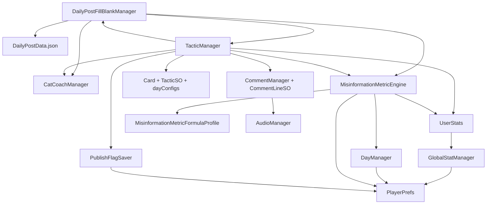

# Project and dependency guide

Reviewed: 2026-09-24. Scope: the current local working tree, including existing uncommitted changes. This is a source and serialized-asset inspection, not a successful build certification or a package-upgrade assessment.

## Project overview

`nutritionGame` is a C# Unity game about nutrition misinformation and social-media publishing. The player chooses a topic, subtopic, caption and fill-in-the-blank words, then a persuasion tactic. A coach can flag poor caption choices. Publishing displays a post and comments, then updates money, followers, credibility and likes. Day progression, jobs and ending stories provide the surrounding game loop.

Gameplay is implemented with Unity components, uGUI panels and TextMeshPro. Content comes from local JSON and ScriptableObject assets; save state uses `PlayerPrefs`. No external backend, database service, authentication SDK or gameplay HTTP client was found in the project-owned scripts. Installed Unity tooling may have its own online requirements.

## Development environment and authoritative files

| Requirement/source | Repository evidence and meaning |
| --- | --- |
| Unity Editor | **6000.6.0f1**, revision `f7f8ed4d1e24`, from `ProjectSettings/ProjectVersion.txt`. Use this version to reproduce the project. |
| Project configuration | `ProjectSettings/` defines player, input, graphics and scene settings. Product: `nutritionGame`; company: `UMass Boston`. |
| Direct packages | `Packages/manifest.json` declares requested packages. |
| Resolved packages | `Packages/packages-lock.json` records actual versions, sources and dependency edges. Preserve it with the manifest. |
| Unity UI | `com.unity.ugui` 2.6.0 comes from the Unity 6000.6 editor installation and includes TextMeshPro. The previously embedded 2.0.0 copy was already removed before package cleanup. |
| C# tooling | Unity manages compilation. Rider/Visual Studio integration packages were removed; generated `.csproj`/solution files are not the package authority. No separate .NET 10 requirement is established by generated files under `Assets/Scripts/obj/`. |
| Build target support | Install the Unity platform module for the intended export. The three scenes below are configured, but target builds were not verified. Android has a serialized IL2CPP backend override. |
| Input | `activeInputHandler: 2` enables both input backends; scenes use the new Input System UI module. `Assets/InputSystem_Actions.inputactions` is referenced by build settings. |

## Scenes and initialization

The enabled build order in `ProjectSettings/EditorBuildSettings.asset` is:

| Index | Scene | Project components present in scene |
| --- | --- | --- |
| 0 | `Assets/Scenes/1 Main Page.unity` | Persistent `DayManager` and `GlobalStatManager`, scene UI links, ending resolver/collection and teenager simulation. |
| 1 | `Assets/Scenes/2 Home Page.unity` | Daily-post availability, jobs, publish flag, loading UI and ending transition. |
| 2 | `Assets/Scenes/3 Game.unity` | Daily-post composition, tactic selection, metric engine, coach, comments, stats, hints and audio. |

Main Page contains the persistent session managers. `DaySceneLink.Awake` now creates missing day/stat managers when Home or Game is opened directly, loading existing saved progress before scene UI starts. Existing managers are reused; the daily post flag is not reset on scene entry. The Home scene's serialized ending destination is build index **0**, even though the transition script's field default is 1. Preserve build order or update that reference. The scene navigation strings include `2 Home Page` and `3 Game`.

## Internal dependency map

Arrows mean “uses or depends on”; scene wiring and UnityEvents also connect these components.

| System | Dependencies and behavior |
| --- | --- |
| `DailyPostFillBlankManager` | Inspector-assigned JSON `TextAsset`, UI prefabs/panels, `TacticManager`, `CatCoachManager` and metric engine. Parses with Unity `JsonUtility`. |
| `TacticManager` | `Card` prefab, `TacticSO` data, per-day `dayConfigs`, current day, post manager, hints, coach, comments and stats. Coordinates post text, comment playback, metric animation and completion. Formula scoring is enabled in the Game scene; a legacy simple scoring branch remains in code. |
| `MisinformationMetricEngine` | Formula profile, caption/word choices, selected tactic and current stats/day. Calculates post outcomes, repetition penalties and fact-check effects; stores history in preferences. Missing profile prevents result application. |
| `UserStats` / `GlobalStatManager` | Scene-facing stat animation versus persistent money/follower/credibility storage. Likes are shown in `UserStats` but are not among the three values persisted by `GlobalStatManager`. |
| `DayManager` / scene links | Persistent current day, default maximum 31; `DaySceneLink` and `StatSceneLink` reconnect scene UI to persistent managers. Advancing a day clears the posted-today flag. |
| Daily-post availability | `PublishFlagSaver` and `DailyPostButtonController` use `HasPostedToday`; posting and day advancement must remain coordinated. |
| `CommentManager` / audio | Loads comment assets by resource path. `PostCommentSelector` filters by tactic, topic, subtopic, caption and preview outcome; selects up to four unique comments with randomized ties. Uses the same prepared metric preview as publishing. Audio is optional; comment text must be configured. |
| Jobs | `JobPostManager` uses configured offers, current day, saved job progress and player rewards. |
| Endings | `EndingTransitionManager`, `EndingSceneAutoResolver`, `EndingStoryCollectionPanel` and `EndingStoryDatabase` depend on stats/day, preference keys, UI references and scene build order. |
| Simulation | `TeenagerEndingSimulation` uses a formula profile and configured simulated populations; can write CSV reports to `Application.persistentDataPath`. This is a simulation utility, not evidence of automated gameplay test coverage. |

Project scripts are under `Assets/Scripts/`; the `Yanyan/Forumla/` directory spelling is intentional here because it matches the repository. No project-owned assembly definition was found in Assets, so scripts primarily use Unity's default runtime/editor assembly layout.

## Content, assets and persistence

| Data or asset | Consumer / dependency contract |
| --- | --- |
| `Assets/Scripts/Yanyan/Save/DailyPostData.json` | Assigned to the Game scene's post manager. Supplies topic/subtopic/caption/word-choice and scoring data. Keep its structure compatible with the serializable classes in `DailyPostFillBlankManager.cs`. |
| `Assets/Scripts/Yanyan/Forumla/MisinformationMetricFormulaProfile.asset` | Referenced from Game and Main Page; contains scoring configuration. |
| `Assets/Scripts/Yanyan/Ending/EndingStoryDatabase.asset` | Ending story content and collection configuration. |
| `Assets/Resources/Content/Tactics/` | `TacticManager` loads `Content/Tactics`; its actual card list also depends on Inspector `dayConfigs`. |
| `Assets/Resources/Content/Comments/` | `CommentManager` loads `Content/Comments/`. Optional type matches the tactic category or ID; topic/subtopic/caption fields restrict the post. Blank fields are wildcards. See `COMMENTS.md` for authoring. |
| Other `Resources/Content/` folders | Audiences, Quests and DebriefCards have data models and imported assets; no direct resource-loading consumer was found for them in gameplay scripts. `Funda_Tactics` is not the hard-coded tactics load path. |
| `Assets/Content/CSV/` | Authoring inputs: `tactics.csv`, `comments.csv`, `audiences.csv`, `quests.csv`, `debrief_cards.csv`. `Assets/Editor/NutriGameCsvImporter.cs` exposes **FFT > Import All CSVs**, writing/updating assets under `Assets/Resources/Content/`. Sprite paths in CSV rows must resolve. Importing can overwrite authored asset fields; it is not required merely to open the existing game. |
| Daily-post editor | `Assets/Editor/DailyPostJsonEditorWindow.cs` exposes **Tools > Misinformation Game > Daily Post JSON Editor**. |
| UI/media | `Assets/Layer Lab/GUI-MonoRound/` and `GUI Pro-SimpleCasual/` contain vendored art; `Assets/Fonts/` and `Assets/TextMesh Pro/` provide font/TMP assets. Preserve relevant scene/prefab references and `.meta` GUIDs. Asset-pack versions were not established. Keep bundled license notices; no complete license audit was performed. |

`PlayerPrefs` keys include `SavedCurrentDay`, `HasPostedToday`, `User_Cash`, `User_Followers`, `User_Credibility`, the metric engine's configurable `MisinformationMetrics_` prefix, and job/ending keys. Changing keys or project identity can affect save continuity. There is no separate save-server dependency visible in gameplay code.

## Package cleanup and retained dependencies

The unused AI Assistant, AI Generators, 2D Enhancers, Unity Version Control, Rider integration, Visual Studio integration and Timeline packages were removed. The broad 2D feature bundle was replaced with explicit Sprite, PSD Importer and 2D Tooling dependencies, removing 2D Animation, Aseprite, Pixel Perfect, SpriteShape and Tilemap Extras. Shared packages remain only where required by the retained dependency graph. No engine module declarations were removed.

The missing UI dependency was restored using the editor-bundled uGUI 2.6.0 package. Input System and Test Framework remain. The lockfile retains existing versions for reachable dependencies and uses the installed editor's metadata for uGUI.

### Direct non-module packages

| Package | Version | Source |
| --- | --- | --- |
| `com.unity.2d.psdimporter` | `15.0.0` | registry |
| `com.unity.2d.sprite` | `1.0.0` | builtin |
| `com.unity.2d.tooling` | `4.0.0` | registry |
| `com.unity.inputsystem` | `1.20.0` | registry |
| `com.unity.test-framework` | `1.8.0` | builtin |
| `com.unity.ugui` | `2.6.0` | builtin |

### Transitive non-module packages

| Package | Resolved version | Required by |
| --- | --- | --- |
| `com.unity.2d.common` | `15.0.0` | `com.unity.2d.psdimporter`, `com.unity.2d.tooling` |
| `com.unity.2d.tilemap` | `1.0.0` | `com.unity.2d.psdimporter` |
| `com.unity.burst` | `2.0.0` | `com.unity.2d.common`, `com.unity.collections` |
| `com.unity.collections` | `6.6.0` | `com.unity.2d.common` |
| `com.unity.ext.nunit` | `2.1.0` | `com.unity.test-framework` |
| `com.unity.mathematics` | `1.4.0` | `com.unity.2d.common` |
| `com.unity.nuget.mono-cecil` | `1.11.6` | `com.unity.collections` |
| `com.unity.test-framework.performance` | `6.6.0` | `com.unity.collections` |

The PSD importer retains the base Tilemap package transitively. This does not imply the game uses tilemaps. Registry packages resolve through `https://packages.unity.com`; built-in packages come from the editor.

### Engine modules

All declared `com.unity.modules.*` packages are retained at version 1.0.0. Exact versions and dependency edges are in `Packages/packages-lock.json`. Module presence alone does not establish gameplay usage.

## Maintenance findings and verification limits

1. **Ready Player Me remnants:** root-level generated `ReadyPlayerMe.Samples.*.csproj` files and `READY_PLAYER_ME` scripting defines remain, but the current manifest/lockfile has no Ready Player Me package and no project script imports it. Its settings assets are already deleted in the local working tree. Treat this as historical configuration, not an established installation requirement.
2. **Duplicate editor tools:** `Assets/DailyPostJsonEditorWindow.cs` and `Assets/DailyPostFillBlankManagerEditor.cs` are byte-identical copies of files under `Assets/Editor/`. Both copies are guarded by `UNITY_EDITOR` but compile into different default assemblies, creating duplicate tool/type definitions and a potential editor registration ambiguity. This inspection did not establish a build failure.
3. **Generated files inside Assets:** `Assets/Scripts/obj/Debug/net10.0/` contains generated C# files. Review whether Unity imports these before relying on a clean build; their presence is not a reason to install .NET 10 as a game dependency.
4. **Serialized configuration is essential:** package restoration alone cannot recreate the game. Retain scenes, prefabs, resource folders, input actions, profile assets and `.meta` files. Object names, resource paths, string types and build indices are dependencies too.
5. **Validation performed:** read manifests, package metadata, build/player settings, project scripts, and mapped scene script GUIDs to local source files. After cleanup, checked manifest/lockfile consistency and dependency closure. A separate batch validation could not start because this project was already open in Unity; triggered Assets > Refresh in the existing editor instead. Full Play Mode and platform-build validation remain outstanding.

## Reproducing and checking the project

1. Open the repository root in Unity **6000.6.0f1**, with the intended target platform's build module installed.
2. Let Unity restore the manifest/lockfile dependencies, including editor-bundled uGUI 2.6.0. Inspect the Console for import or compiler errors, including any related to the maintenance findings above.
3. Confirm the three enabled scenes and their order. Open `Assets/Scenes/1 Main Page.unity` to initialize the persistent managers.
4. Check topic → subtopic → caption → word choices → coach → tactic → publish. Confirm comment playback, stat updates, posted-today gating and return to Home.
5. Check next-day progression, jobs, save/reload and ending return to Main Page. Use a disposable save state if resetting preferences for testing.
6. Make a target-platform build before claiming platform compatibility. Update this guide when package versions, scene order, resource paths or content contracts change.
